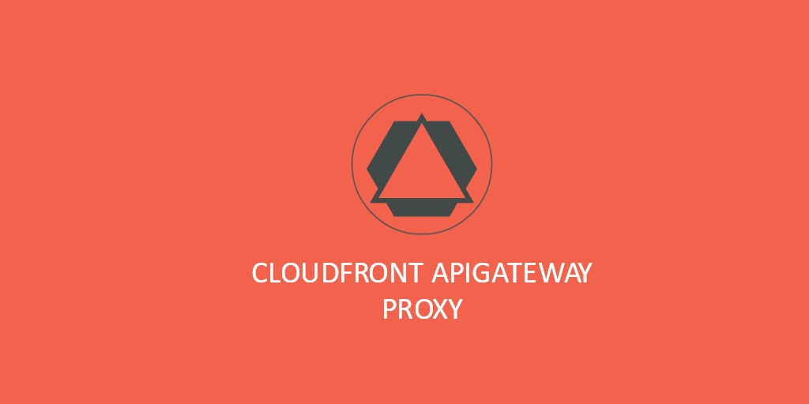

# cloudfront-apigateway-proxy

Using Cloudfront as API Gateway Proxy with Cookie support to store API Gateway Access Token JWT

[![npm package][npm-badge]][npm]

[npm-badge]: https://img.shields.io/npm/v/npm-package.png?style=flat-square
[npm]: https://www.npmjs.org/package/npm-package
